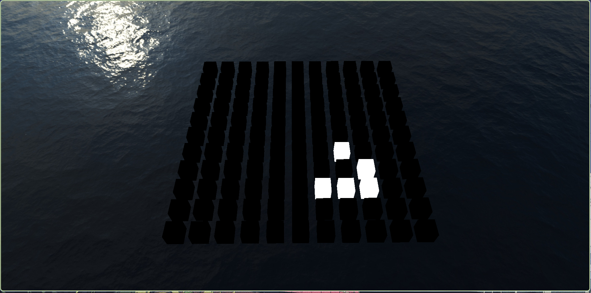

# Game of Life — `gol`

**gol** is a cross‑platform implementation of Conway’s Game of Life written in C++20. The project is split into two parts:

- **`engine/`** – game‑independent utilities (math, containers, logging, error handling, etc.).
- **`gol/`** – the Game of Life itself: world representation, JSON serialisation, simulation logic.

The application loads an initial world state from a JSON file, runs the simulation step by step, and visualises the result using a tiny rendering layer built on OpenGL.

---

## Build Instructions

### Prerequisites

- **CMake** 3.10 or newer
- **C++20** compiler (Clang, GCC, or MSVC)
- **OpenGL** development libraries
- **SDL3** and **glm** (vendored, by default)
- (Optional) **ccache** for faster rebuilds

### Quick Start

```bash
# Clone the repository
git clone https://github.com/feelamee/gol.git
cd gol

# Configure with CMake (uses presets)
cmake --preset release

# Build the project
cmake --build --preset release

# Run the application
./build/release/gol/gol-simulation
```

### CMake Options

The following options can be passed to `cmake` to tweak the build:

| Option | Default | Description |
|--------|---------|-------------|
| `GOL_DEV` | `OFF` | Enable development mode (sanitizers, assertions, tests) |
| `GOL_SANITIZERS` | `GOL_DEV` | Enable AddressSanitizer, LeakSanitizer, UBSan |
| `GOL_ASSERTIONS` | `GOL_DEV` | Enable runtime assertions |
| `GOL_TESTS` | `GOL_DEV` | Build test suite |
| `GOL_CCACHE` | `GOL_DEV` | Use ccache if available |
| `GOL_HARDENING` | `OFF` | Enable compiler hardening flags |
| `GOL_USE_SYSTEM_LIBRARIES` | `OFF` | Use system‑installed **SDL3** and **glm** dependencies instead of vendored ones |

---

## Running the Application

The program looks for an input file named `game_of_life_input.json` in the executable directory.

The application will:

1. Load the world state from the JSON file.
2. Run the simulation (step count is defined in the input).
3. Render the world using OpenGL.
4. On exit, write resulting world state into `game_of_life_output.json` in the executable directory

Inside application player presented as camera and can fly around.
Keybindings:
- to move around, press mouse `middle-button + WASD`
- to rotate view, press mouse `middle-button + move mouse`
- to speedup moving, hold `SHIFT`

If moving didn't work, try to click left-mouse-button anywhere.
This is a known Dear ImGui bug. See https://github.com/ocornut/imgui/pull/9243 for details.

---

## Example Input File (`game_of_life_input.json`)

```json
{
    "world": {
        "width": 11,
        "height": 11,
        "cells": [
            ".*.........",
            "..*........",
            "***........",
            "...........",
            "...........",
            "...........",
            "...........",
            "...........",
            "...........",
            "...........",
            "..........."
        ]
    },
    "simulation": {
        "fps": 30,
        "cycles": 100
    }
}
```

| Field | Type | Description |
|-------|------|-------------|
| `width` | unsigned integer | World width in cells |
| `height` | unsigned integer | World height in cells |
| `cycles` | unsigned integer | Number of simulation steps to run |
| `fps` | unsigned integer | Rendering fps |
| `cells` | array of strings | Initial state of the world |

---

## Project Structure

```
gol/
├── CMakeLists.txt          # Top‑level CMake
├── CMakePresets.json       # CMake presets
├── engine/                 # Game‑independent engine
│   ├── include/engine/     # Public headers
│   └── src/                # Implementation
├── gol/                    # Game of Life specific code
│   ├── include/gol/        # Public headers
│   └── src/                # Implementation
├── vendor/                 # Vendored dependencies
├── assets/                 # Runtime assets (textures, models)
├── cmake/                  # CMake helper scripts
└── misc/                   # Misc files like task description
```

---

## Used Libraries

All libraries are either vendored in `vendor/` or can be picked up from the system:

- **SDL3** – window creation and input handling
- **glm** - for linear algebra
- **glad** – OpenGL function loading
- **nlohmann/json** – JSON parsing and serialisation
- **Dear ImGui** – for ui rendering
- **doctest** – for unit tests (if `GOL_TESTS=ON`)

---

## Cover Letter (Brief Summary)

### Approach and Architecture

The project follows a clean separation between **engine** and **game** code. The engine provides reusable building blocks (math, containers, logging, OpenGL context management, error handling) that are completely independent of the Game of Life logic. The game layer implements the actual simulation, world state management, JSON I/O, and rendering of the cell grid.

This architecture makes the engine reusable for other projects and keeps the game code focused and maintainable.

### Implemented Parts

- **World** (`world.hpp`) – stores the cell grid, computes the next generation using the classic rules, and supports step‑by‑step simulation.
- **JSON serialisation** (`world_json.hpp`) – loads initial states from and dumps results to JSON files.
- **World scene node** (`world_scene_node.hpp`) – bridges the world state with the rendering system.
- **Rendering** – uses OpenGL to draw the cell grid as a set of coloured quads, with camera controls for pan and zoom.
- **Build system** – CMake with presets, optional sanitizers, ccache support, and CI workflows (GitHub Actions) for checkbuild and tests.

### Used Libraries, Tools, and AI

- **Libraries**: SDL3, glad, nlohmann/json, imgui, glm.
- **Build tools**: CMake, ccache.
- **Debugging tools**: gdb, RenderDoc
- **Static analysis**: `.clang-tidy` configuration.
- **CI**: GitHub Actions for automated builds and test runs.
- **AI assistance**:
    No AI tools were used in writing the code; all implementation is original.
    chat.deepseek.com is used to ask questions about OpenGL usage (specificaly, about SSBO).
    It is also used to write this README.md (still carefuly reviewed by me).

### Limitations and Simplifications

- The simulation implementation is intentionally naive and not optimized
- The simulation uses a fixed grid size defined at load time.
- The simulation is **CPU‑side** (no GPU compute shaders), which is fine for moderate grid sizes but may not scale to millions of cells.
- The engine’s OpenGL wrapper is lightweight and does not support advanced features like instanced rendering or shader hot‑reloading. It is still in progress library.
- There is a memory leak somewhere (probably in SDL3). Each 5-10 seconds, memory usage grows on 1MB.

### Additional Notes

- The project is developed with **portability** in mind – it builds on Linux, macOS, Windows. And should be easily portable to Android (tho not tested).
- **Sanitizers** (ASan, LSan, UBSan) are available to catch memory errors and undefined behaviour during development.
- `GOL_HARDENING` option is available to build reliable and protected artifacts
- The simulation and JSON I/O is covered with tests (build with `GOL_TESTS=ON`, then run `gol-simulation-test`)
- Availabe `--headless` mode - it allows to fully check task without creating window and rendering.

